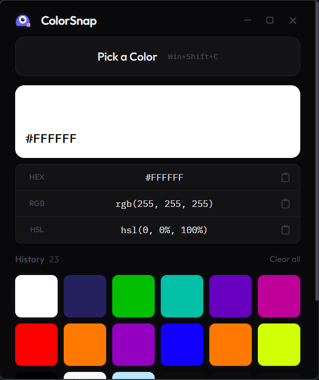

<div align="center">


# ColorSnap

**Screen color picker for Windows**

Pick any color from your screen instantly with a keyboard shortcut.

[](https://github.com/AleenaTahir1/ColorSnap/releases)
[](https://github.com/AleenaTahir1/ColorSnap/actions)
[](LICENSE.txt)

</div>

---

## Why ColorSnap

Most color pickers need you to open a separate app, navigate menus, or use a browser extension. That's too many steps for something that should be instant.

ColorSnap runs quietly in your system tray. Press `Win+Shift+C` and pick any color from anywhere on your screen. The value is copied to your clipboard automatically.

---

<div align="center">

</div>

---

## Features

- **Instant pick** — Press `Win+Shift+C` to pick a color from anywhere on screen
- **Multiple formats** — Copy as HEX, RGB, or HSL with one click
- **Color history** — All picked colors are saved and browsable
- **Auto-copy** — Color values are copied to clipboard automatically
- **Custom cursor** — Visual feedback with a branded cursor during pick mode
- **System tray** — Runs quietly in the background
- **Dark theme** — Clean, minimal dark UI

---

## Installation

Download the latest release from the [Releases](https://github.com/AleenaTahir1/ColorSnap/releases) page:

- **`.msi`** — Standard Windows installer (recommended)
- **`.exe`** — NSIS installer

---

## Usage

### Keyboard Shortcuts

| Shortcut | Action |
|---|---|
| `Win+Shift+C` | Pick a color from screen |
| `Esc` | Cancel pick mode |

### Color Formats

Click any color from history to view all format values:

- **HEX** — `#3B82F6`
- **RGB** — `rgb(59, 130, 246)`
- **HSL** — `hsl(217, 91%, 60%)`

Each format row is individually copyable.

---

## Development

### Requirements

- Node.js 18+
- Rust 1.70+
- Tauri 2 system dependencies

### Run Locally

```bash
git clone https://github.com/AleenaTahir1/ColorSnap.git
cd ColorSnap
npm install
npm run tauri dev
```

### Build

```bash
npm run tauri build
```

### Project Structure

```
ColorSnap/
├── src/                    # Frontend (React + TypeScript)
│   ├── components/         # UI components
│   ├── hooks/              # Custom hooks
│   ├── types/              # TypeScript types
│   └── utils/              # Color conversion utilities
├── src-tauri/              # Backend (Rust)
│   ├── src/
│   │   ├── lib.rs          # App setup, commands, tray
│   │   └── color_picker.rs # Screen capture, cursor, pick logic
│   └── capabilities/       # Tauri 2 permissions
└── package.json
```

---

## Tech Stack

- **Frontend** — React 18, TypeScript, Tailwind CSS
- **Backend** — Rust, Tauri 2
- **Screen Capture** — xcap
- **Build** — Vite

---

## License

This project uses a **Source Available** license. See [LICENSE.txt](LICENSE.txt) for details.

- Free for personal and educational use
- Free to modify for personal use
- Commercial use requires permission

---

## Author

**Aleena Tahir**

- GitHub: [AleenaTahir1](https://github.com/AleenaTahir1)
